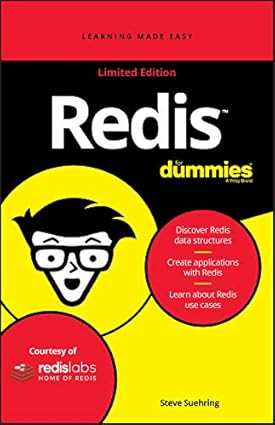

# Pratica Redis

Conteudo da Pratica:

 + 1° [Install Redis](./install-redis) - Como instalar o redis;
 + 2° [Data Structures](./data-structures) - Estruturas de dados no Redis, Strings, BitMaps, List, Sets, Hashes, 
 + 3° [Patterns](./patterns) - Pub/Sub, GeoSpatial, Redis Streams
 + 4° [Redis Modules](./modules) - Redis Search, Redis Graph, Redis TimeSeries 

**UNDER CONSTRUCTION**:
  + 5° Pipeline and Transactions
 + 9° Strategy Cache in Production
 + 10° Secure in Production
 + 11° Monitor Redis in Production

<!-- 

## Faq

A need use in production free?
R: yes

 -->

## References

  + [Book Redis for Dummies](https://redis.io/resources/redis-for-dummies/) - Redis for Dummies 2nd Edition 

