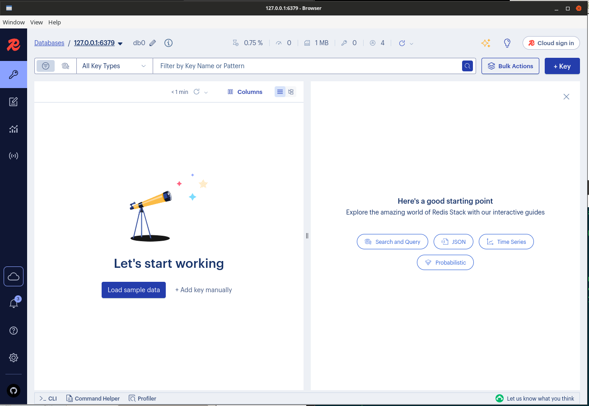
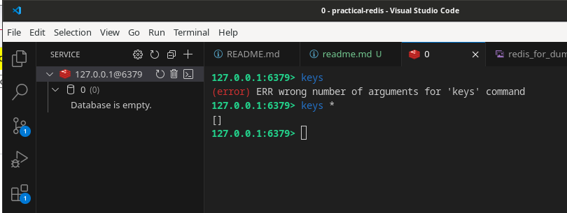

> Eu,
> Nessa pratica nós sempre usaremos o docker
> Mas pode fazer com o redis cloud e conectar com a extenção [redis-vscode](https://redis.io/docs/latest/develop/tools/#redis-vscode-extension) ou [redis-insight](https://redis.io/docs/latest/develop/tools/#redis-insight).
> Vamos usar o redis-for-vscode ou o redis-cli. Use:
```bash
sudo docker run --name my-redis -p 6379:6379 -d redis 
```




# Implantando o Redis

> Resumido e/ou Traduzido do livro.
> Obrigado GPT!!!

Você pode instalar o Redis da seguinte forma:

- [Redis Enterprise Cloud](#usando-o-redis-enterprise-cloud)
- [Compilando a partir do Código Fonte](#compilando-a-partir-do-codigo-fonte)
- [Docker](#usando-redis-no-docker)


## Usando o Redis Enterprise Cloud

O Redis oferece um plano gratuito de 30MB com os principais fornecedores de nuvem, como Amazon Web Services (AWS), Google Cloud e Microsoft Azure. Quando
você se inscreve no Redis Enterprise Cloud em https://redislabs.com/
try-free, receberá um e-mail com instruções sobre como ativar
o plano gratuito.

Após a ativação, siga estas etapas:

1. Escolha um provedor de nuvem e uma região para a implantação  
do Redis Enterprise Cloud.

2. Escolha o tamanho a ser usado para a implantação e clique em  
    **Criar**.  A opção gratuita de 30MB está disponível junto com outras opções pagas.
    Se você está apenas começando com o Redis, a opção gratuita de 30MB  
    permite que você rapidamente tenha uma noção de suas capacidades.

3. Selecione e configure vários parâmetros relacionados à base de dados e clique em **Ativar**. Estes parâmetros incluem o nome da base de dados, protocolo, se a replicação está ativada ou desativada, controlo de acesso e segurança, a política de eliminação de dados, alertas e o(s) módulo(s) a incluir.  Após clicar em **Ativar**, os parâmetros de configuração da base de dados são mostrados.

Agora você está pronto para conectar-se ao endpoint do banco de dados e começar  
a trabalhar com o banco de dados e integrar sua aplicação. Você  
pode encontrar mais informações sobre esta próxima etapa na seção "Dando os  
Primeiros Passos com o Redis", mais adiante neste capítulo.

## Compilando a partir do codigo fonte

O Redis pode ser compilado a partir do código-fonte. Esta opção é útil quando você tem necessidades estendidas que não estão disponíveis em uma opção pré-empacotada.

Também é muito útil quando você deseja usar novos recursos ou uma versão preliminar do Redis. A compilação a partir do código-fonte é normalmente feita em um ambiente Linux; os exemplos nesta seção usam Debian Linux, embora outras distribuições tenham um processo similar, se não o mesmo.

Você pode baixar o código-fonte em https://redis.io/download. O código-fonte do Redis é baixado como um arquivo compactado .tar. Após baixar o arquivo, siga estes passos:

### 1. Descompacte e extraia o software com o comando tar.

Por exemplo, no momento da escrita, a versão mais recente do Redis era a 6.2.2, tornando o comando o seguinte:
	
```bash
tar -zxvf redis-6.2.2.tar.gz
```
Ajuste o comando, conforme necessário, para corresponder à versão do Redis que você baixou. Executar o comando tar com as opções mostradas resulta no
código-fonte sendo descompactado em seu próprio diretório.


### 2. Acesse o diretório do código-fonte e inicie o processo de compilação.


Você tem algumas opções quando se trata de como a compilação e o software resultante se comportam. Por exemplo, você pode configurar o Redis para trabalhar com systemd. Fazer isso requer que as bibliotecas de desenvolvimento relacionadas ao systemd estejam disponíveis.

Mais informações sobre a integração com systemd e outras opções para compilar o Redis são encontradas no arquivo README.md, que pode ser visualizado com qualquer editor de texto ou pager terminal.


Usando a opção padrão, acessar o diretório do código-fonte do Redis é realizado com o comando `cd`, e compilar o Redis é feito com o comando `make`:
```bash
cd redis-6.2.2
make
```

Como antes, ajuste o comando, conforme necessário, para corresponder à versão do Redis que você baixou.

O processo de compilação começa. Se tudo correr bem, você receberá uma mensagem indicando que é uma boa ideia executar `make test` em seguida.

No entanto, se o processo de compilação não funcionar corretamente, um erro e possivelmente um backtrace serão mostrados.

Um motivo comum para erros durante o processo de compilação é a falta de uma ou mais dependências.

A(s) dependência(s) precisará(ão) ser instalada(s). Depois de fazer isso, é uma boa ideia limpar quaisquer arquivos em cache da tentativa de compilação anterior falha executando o comando `make dist-clean`.

> EU,
> Li em um livro que pode ser uma boa ideia compilar para 32 bits, pela redução de uso de espaço em memoria Ram que um inteiro de 32 bits ocuparia.
> Claro que se vc compialr um programa para 32 bits vc ficaria limitado a 4gb de ram, uma vez que programas com inteiros de 32 bits, normalmente não conseguem indexar valores com memoria alem de 4 gb. 


### 3. Após a compilação ter funcionado, execute os testes incluídos  com o código-fonte.  


Executar os testes pode ser feito com o seguinte comando:  
```bash
make test
```

O processo de teste levará mais tempo do que o processo de compilação,  
mas você terá mais confiança de que a instalação funcionará  
corretamente.  

Com a compilação e os testes concluídos, o servidor Redis está pronto.  
Quando compilado a partir do código-fonte, o servidor está localizado no diretório `src`.  
Você também pode instalar o software no diretório `/usr/local/bin`  
com o seguinte comando:  
```bash
sudo make install
```

No entanto, se você está apenas testando o Redis, executar a partir do diretório `src`,  
assim, funciona bem e não requer privilégios sudo:  
```bash
cd src && ./redis-server
```

O servidor inicia e é executado na porta 6379 por padrão. Você pode parar  
o servidor pressionando Ctrl+C.


## Usando Redis no Docker

Supondo que você tenha o Docker instalado, você pode baixar a versão mais recente da imagem Docker do Redis do DockerHub com o comando:
```
docker pull redis
```

Após a imagem ser baixada, execute o Redis no container com o comando `docker run`. Neste exemplo, será executada uma instância de container chamada `my-redis`:
```
sudo docker run --name my-redis -p 6379:6379 -d redis 
```

Mais informações sobre a instalação do Redis no Docker podem ser encontradas em https://hub.docker.com/_/redis. Se você precisar instalar o próprio Docker, mais informações podem ser encontradas em www.docker.com.


